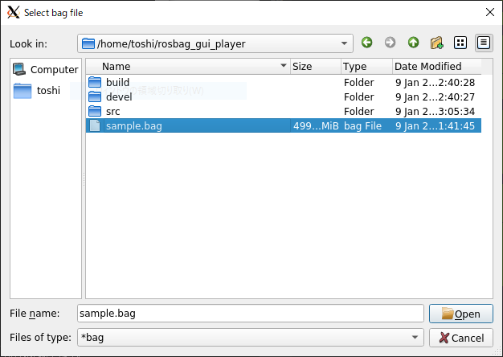
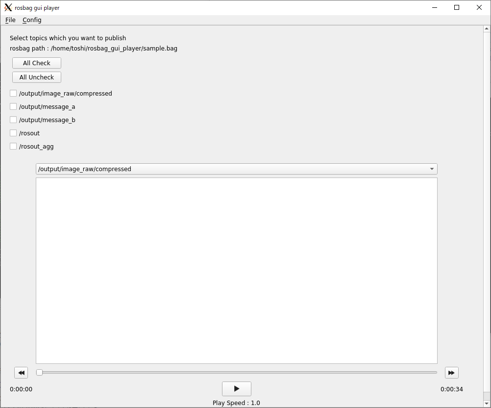
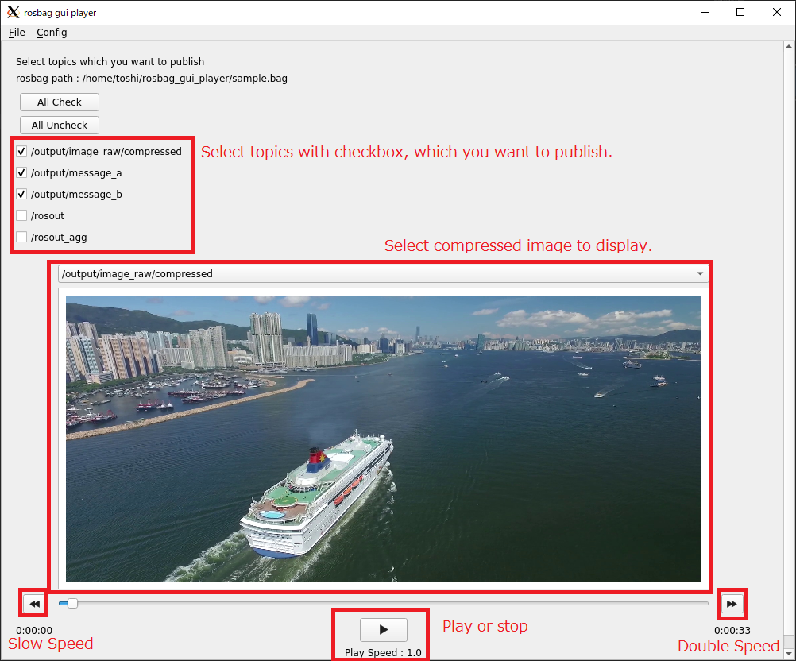
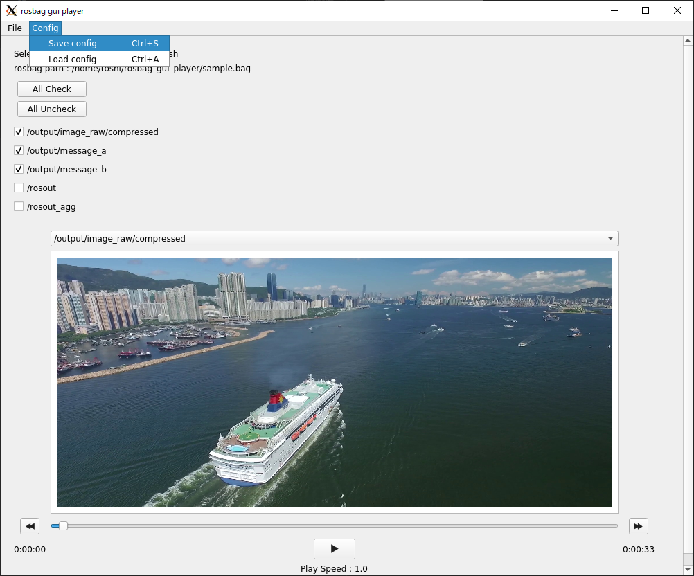
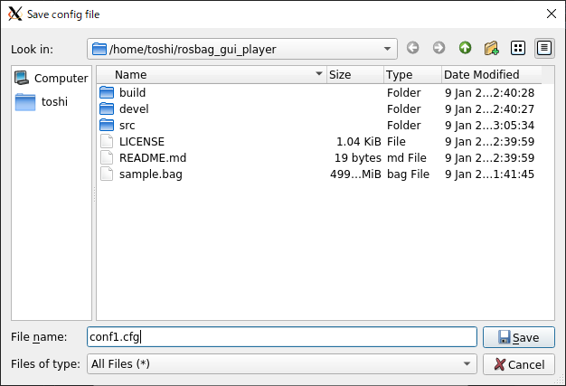
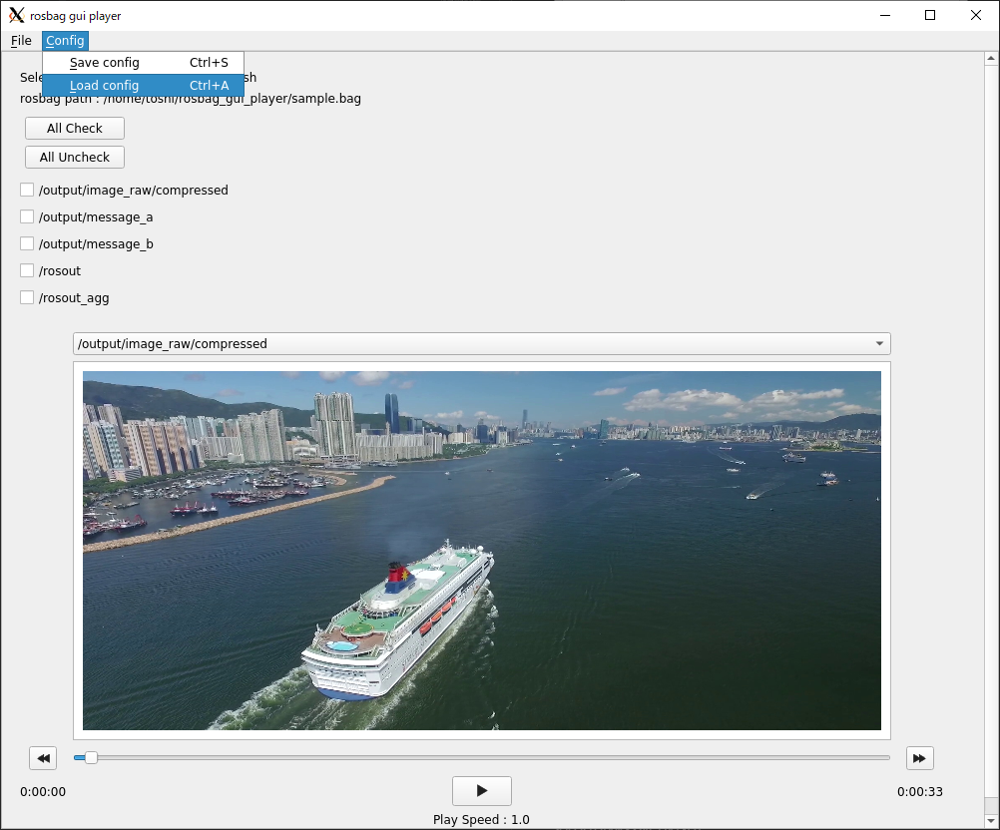
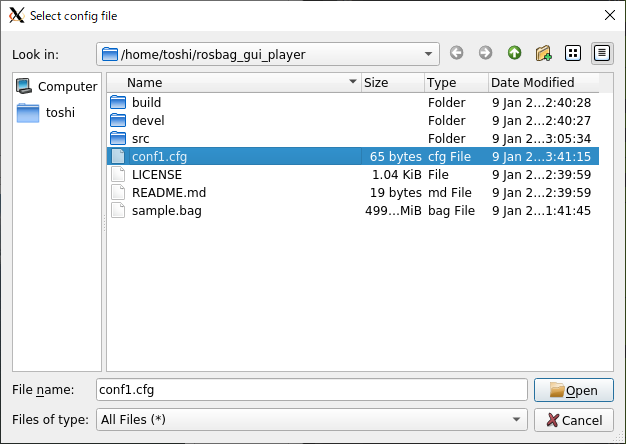
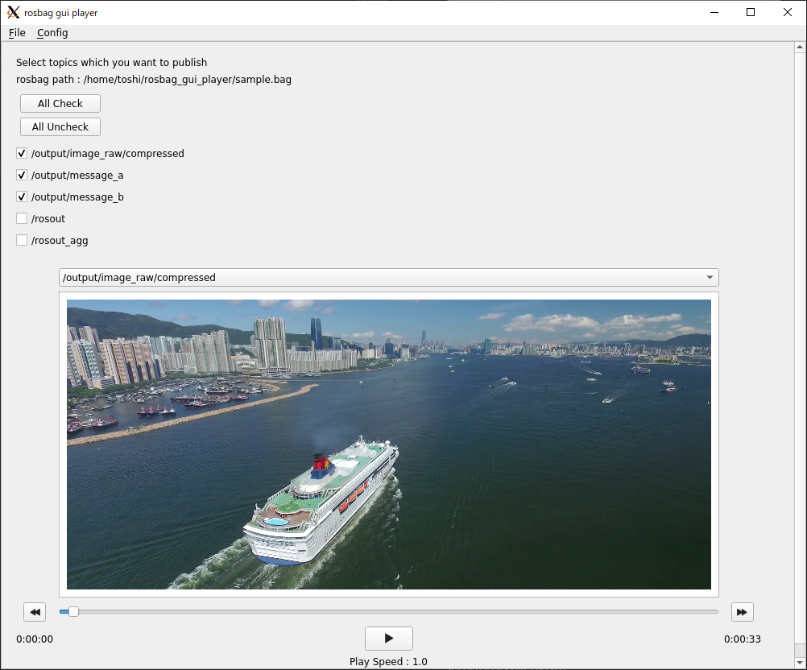

# rosbag_gui_player
A GUI rosbag player tool for python3.  
You can play rosbag as if you are operating a media player by this tool.

# How to use
## 1. Clone this package
Clone This package to YourWorkspace.
> git clone https://github.com/tosiyuki/rosbag_gui_player.git

## 2. Run the script
### Terminal1
> cd ~/YourWorkspace  
> source devel/setup.bash  
> roscore

### Terminal2
> cd ~/YourWorkspace  
> source devel/setup.bash  
> python3 src/MainWindow.py

## 3. Select a bag file which you want to play

load rosbag file.

## 4. Discribe GUI

# Publish topic config function.

## Save config

Click Config -> Save Config

Select saving config file name and push save.

## Load Config

Click Config -> Load Config

Select loading config file name and push open.

Selected topicks are checked.

# License
MIT

